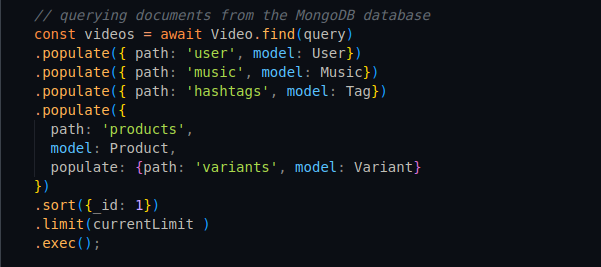
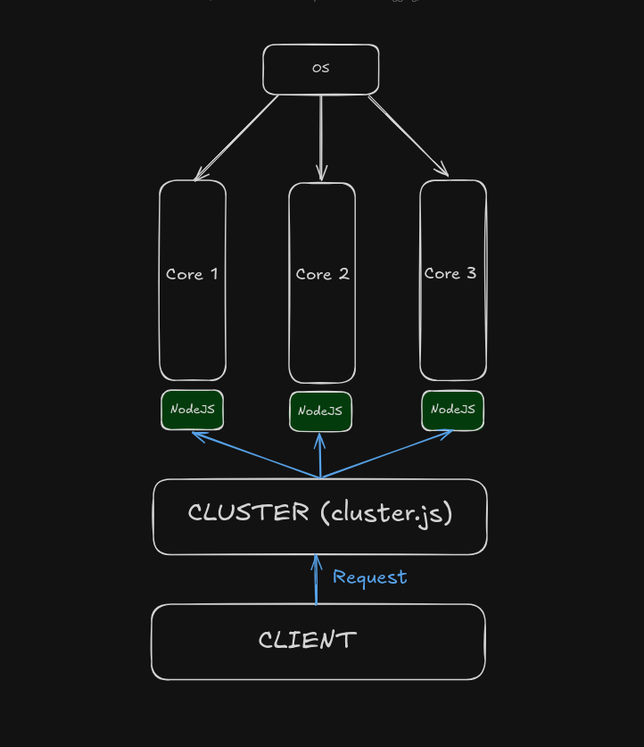

# Attyre Assignment

This documentation provides a brief overview of the API endpoint developed for the *Attyre Intern Assignment*. The main goal of this assignment is to build a robust, efficient and a scalable **Homescreen API**. The following sections detail the implementation of the **Homescreen API**.

# Technologies 
The following technologies have been used for this assignment:

- NodeJS
- ExpressJS
- MongoDB

The source files can be found in the repository. (Additonally, comments have been added for better code clarity and readability)

# API Contract

The *structure* of the data the **Homescreen API** endpoint will return is as follows:
```json
{
  "videos": [
    {
      "id": 2,
      "video_url": "https://example.com/videos/newvideo.mp4",
      "thumbnail_url": "https://example.com/thumbnails/newthumbnail.jpg",
      "description": "Winter fashion trends 2024 #winterfashion #trendalert",
      "view_count": 1500,
      "duration": 60,
      "created_at": "2023-06-15T14:00:00Z",
      "user": {
        "id": 1,
        "username": "fashion_lover",
        "display_name": "Fashion Lover",
        "profile_picture_url": "https://example.com/profiles/user1.jpg",
        "bio": "Fashion enthusiast and trendsetter",
        "followers_count": 20000,
        "verified": true
      },
      "products": [
        {
          "id": 1,
          "name": "Cozy Sweater",
          "price": 59.99,
          "original_price": 79.99,
          "discount_percentage": 25,
          "image_url": "https://example.com/products/cozy_sweater.jpg",
          "timestamp": 15,
          "currency": "USD",
          "store": {
            "id": 5,
            "name": "WinterWear Co.",
            "logo_url": "https://example.com/stores/winterwear_logo.jpg"
          },
          "in_stock": true,
          "variants": [
            {
              "id": 101,
              "name": "Size",
              "options": ["S", "M", "L", "XL"]
            },
            {
              "id": 102,
              "name": "Color",
              "options": ["Red", "Blue", "Green"]
            }
          ]
        }
      ],
      "likes_count": 500,
      "comments_count": 150,
      "shares_count": 75,
      "is_liked": false,
      "is_bookmarked": false,
      "music": {
        "id": 301,
        "name": "Winter Wonderland",
        "artist": "Frosty Tunes",
        "cover_url": "https://example.com/music/winter_wonderland.jpg"
      },
      "hashtags": [
        "winterfashion",
        "trendalert"
      ]
    }
  ],
  "pagination": {
    "page": 1,
    "limit": 10,
    "total_pages": 1,
    "total_videos": 1,
    "next_cursor": null
  }
}
```

The above `JSON` structure represents a collection/group of video content related to fashion trends. Each video object includes important properties such as the *video URL* *thumbnail URL*, *description* and much more. It also contains metadata about the user associated with the video, including their profile information. Apart from the user metadata, the video object also includes *products* associated with the video. It also contains metadata about the product details such as *price*, *discount* and much more.

The given sample structure also contains **engagement** metrics such as *likes count*, *comments_count* and much more. Additionally, it includes metadata for *music* associated with the video. It also contains an **array** of tags that specify what *tag* the video belongs to.

Finally, the endpoint would also return a **pagination** object which will help in effecient content retrieval for the application's homescreen.

# Designing the Schema 

This assignment solution makes use of the popular **NoSQL** database, `MongoDB`.

> The database can be populated with sample data by running the populateDatabase.js script (More details can be found at the end of this documentation).

### Why MongoDB?

The reason I chose MongoDB is because of three major reasons:

- Its flexibility and ease of use. Designing a schema in MongoDB is very straight forward and simple. Additionally, because of its document-model nature, I believe it is an ideal choice for a fashion based app where the data structure may undergo changes (or) evolve in the future.

- Its Scalabality. MongoDB is designed to scale **horizontally**. As the data grows, we can handle the load efficiently.

- Familarity. I have prior experience in building web applications using MongoDB.

### Writing The Schema

To write the database schema, I utilized the **Mongoose ODM**. mongoose is a popular *Object Document Mapper* to help 

For the most part, writing the schema was straightforward from the sample **API Contract** given.
Relevant data-types were given for different fields for different *document* schemas. For example the `createdAt` field in the **video.js** schema had a *Date* type.

### Handling Relations In The Database

From the given sample **API Contract**, I concluded that there were the following relations:

#### Video Collection

- Each **Video Document** has a relation with the *Product Document*, the *User Document*, the *Music Document* and the *Tag Document* ([View Details For The Tag Scehma](#more-about-the-tag-schema)).

#### Product Collection

- Each **Product Document** has a relation with a *Store Document* and a collection of *Variants Documents*.

# More About The Tag Schema

- In the given sample **API Contract**, there appears to be no seperate relation/collection for the *Tags* (hashtags). Different videos might have different tags. Different video documents can also **refer** to the same tag. To avoid repetition in providing an array of strings each time, for each **video document**, I decided to write a seperate **Collection** for the tags.

- This **design choice** ensures that each tag is stored **only** once. This can help reduce writing repeated array of strings in the video document and help **maintain** the overall data consistency. It is also highly **scalable**. If the tags are embedded in each product document, retrieving and managing them can become slow and cumbersome.


# Homescreen API Implementation

This section will provide a brief overview of how the *Homescreen API* is implemented and **optimized**:    

The *API* implementation follows a **RESTful** API Design:

- **Seperation Of Concerns**: The `/api/homescreen` endpoint is designed to handle specific resource (`homescreen`) and return the result. The route definitions and the business logic are separated from eacher other ensuring maintainability and readability.

- **Statelessness**: Each request from a client contains all the information the server needs to process (i.e `cursor parameters, limit paramaters`). Each API call is independent from each other.

- **HTTP Methods**: Using the standard **HTTP** `GET` method to fetch resources (`homescreen`) follows the RESTful conventions.

- **Resource Based URL's**: The URI `/homescreen` represents a resource (in this case, the home screen video data). RESTful APIs treat URL's as representations of resources (like videos, users, or products).

#### Design Overview

The design and implementation of the **Homescreen API** was straight forward. This back-end application follows the popular **MVC Pattern**. The `models folder` contains the database schemas, the `views folder` contains the UI and the `controllers folder` contains controller functions to process the incoming request. This pattern ensures modularity and ease of maintenance of the entire codebase.

Additionally, I have implemented **Router Objects** to manage and handle requests from similar routes. The **Router Object** are placed in separate folders as well (`routes`). The creation of **Router** objects ensures *seperation of concerns* and modularity. Moreoever, having router objects will help in easy maintenance and scalability when the application evolves to include more complex routes.

Here, I have defined an `/api` prefix route which will handle routes related to the API, in this case, the **homescreen** api. This is added to the middleware chain which can be found [here](https://github.com/mohammednumaan/attyre-assignment/blob/main/app.js#L52).

> This API implemetation primarily uses the **GET** HTTP method. This is because, the assignment only requires us to **fetch/retrieve** data from the server to use in the front-end (client-side).

> The entire back-end code is written using **NodeJS** a popular JavaScript Runtime for back-end development and the **ExpressJS** library to handle back-end tasks easily and efficiently.

**Pagination**, **Caching** and **Clustering** have been implemented in-order to reduce server and database loads and handle high traffic and large datasets. This following section will explain the *api* in bit more detail along with detalis associated with performance and scalability.

#### Deep Dive: API Implementation

The assignment tasks us to develop a `homescreen endpoint` which will return an array of video objects as well as a single object with `pagination` details for the client-side.

The client can send a `GET` request to the `/api/homescreen` endpoint. Making a `GET` request to that endpoint will return the following data.

```json
{
    "videos": [
        {
            "_id": 1,
            "video_url": "https://example.com/video_1.mp4",
            "thumbnail_url": "https://example.com/thumbnail_1.jpg",
            "description": "This is the description for video_1",
            "view_count": 0,
            "duration": 77,
            "created_at": "2024-10-14T17:37:13.157Z",
            "user": {
                "_id": 102,
                "username": "User_102",
                "display_name": "User_Display_Name_102",
                "bio": "Hello! I am User_102",
                "followers_count": 44743,
                "verified": false,
                "__v": 0
            },
            "products": [
                {
                    "_id": 289,
                    "name": "Product_289",
                    "price": 57.11,
                    "original_price": 127.29,
                    "discount_percentage": 17,
                    "image_url": "https://example.com/product_image_289.jpg",
                    "timestamp": 1728927433108,
                    "currency": "USD",
                    "in_stock": true,
                    "variants": [
                        {
                            "_id": 101,
                            "name": "Size",
                            "options": [
                                "S",
                                "M",
                                "L",
                                "XL"
                            ],
                            "__v": 0
                        },
                        {
                            "_id": 102,
                            "name": "Color",
                            "options": [
                                "Red",
                                "Blue",
                                "Green"
                            ],
                            "__v": 0
                        }
                    ],
                    "__v": 0
                },
                {
                    "_id": 265,
                    "name": "Product_265",
                    "price": 69.54,
                    "original_price": 143.97,
                    "discount_percentage": 23,
                    "image_url": "https://example.com/product_image_265.jpg",
                    "timestamp": 1728927433083,
                    "currency": "USD",
                    "in_stock": true,
                    "variants": [
                        {
                            "_id": 101,
                            "name": "Size",
                            "options": [
                                "S",
                                "M",
                                "L",
                                "XL"
                            ],
                            "__v": 0
                        },
                        {
                            "_id": 102,
                            "name": "Color",
                            "options": [
                                "Red",
                                "Blue",
                                "Green"
                            ],
                            "__v": 0
                        }
                    ],
                    "__v": 0
                }
            ],
            "likes_count": 887,
            "comments_count": 57,
            "shares_count": 58,
            "is_liked": false,
            "is_bookmarked": false,
            "music": {
                "_id": 126,
                "name": "Song_126",
                "artist": "Artist_126",
                "cover_url": "https://example.com/cover_126.jpg",
                "__v": 0
            },
            "hashtags": [
                {
                    "_id": 294,
                    "name": "Tag_294",
                    "__v": 0
                },
                {
                    "_id": 201,
                    "name": "Tag_201",
                    "__v": 0
                }
            ],
            "__v": 0
        },

    ]
    "pagination": {
        "page": 1,
        "limit": 10,
        "total_pages": 30,
        "total_videos": 300,
        "next_cursor": 10
    }
}
```

The above data is a contracted version of the actual returned data. The endpoint will **retrieve** more data depending on the limit and amount of video objects.

The retrieval of data from the database is straightforward. Using the **Mongoose ODM**, we perform a `find` method invokationi which will query the underlying database and fetch us the results. (A snippet of the code is shown below)



> The `populate` method **populates** the fields which refer to a different document in a different collection by populating the actual values of that related document in the final result.

The returned result is a `JSON` format which is the standard for transfering the data.

However, this is not completely suitable for high traffic and server load. The following section will discuss about the performance and scalability solutions.

# Performance and Scalability

To address performance and scalability issues, I have implemented several features to optimize the API endpoint, they are given as follows:

- Response Compression

- Caching (In-Memory Caching)

- Pagination (Cursor Based Pagination)

- Clusters (Similar to Loadbalancing)

## Compression

When delivering a large dataset to the client, it may take large amounts of memory to store and deliver the data. To address this issue, I have implemented `gzip` compression. This basically, compresses `HTTP` responses to smaller files which can be easily stored and delivered. Thereby, decreasing memory usage.

**Without Compression**
- [Without Compression Demo](https://drive.google.com/file/d/1lFCbiiwsMhzfzhwEG8jxvnJQch_YXU4R/view?usp=drive_link)

**With Compression**
- [With Compression Demo](https://drive.google.com/file/d/1c9sTuq0TU3NfQU3EnbQUG4Gkx1eLCYrr/view?usp=drive_link)

As we can see, without compression, the memory consumption is arount **14**kbs. With compression, the memory consumption is around **2-3**kbs. It decreases memory consumption by almost **7x** times

## Caching

It is not performant to re-fetch the data everytime we request a resource on the **same** endpoint. To address this I have implemented an `in-memory` caching mechanism via the `apicache` NodeJS module.

This technique, caches/stores the retrieved data in-memory. When a request to the same endpoint and resource is made, the server will serve the cached data, this reduces database and server loads because, the data is **not re-fetched** from the database.

**Without Caching**

- [Without Cache Demo](https://drive.google.com/file/d/14u3MZPSWYH-XeU4nPmqtUOqAihRdqXDY/view?usp=drive_link)

**With Caching**

- [With Cache Demo](https://drive.google.com/file/d/1n_iU_CY5r4VUPlPMdE3NM0YT1GNELuAV/view?usp=drive_link)

From the above demo we can clearly observe that the initial time taken is about **30-40**ms. Re-requesting the same resource we see the time taken drops to about **3-4**ms. A **10x** drop in time-taken to deliver the data!

Additionally, the caching can be improved by using external caching tools like **Redis**.


## Pagination

Handling large sets of data without any optimization techniques can cause server load during high traffic. To address this issue, I have implemented Pagination.

Pagination is used in APIs (in this case, in, `/homescreen` endpoint) to manage large amounts of data efficiently, particularly when the dataset is too big to return in a single response. 

There are various pagination techniques, like `Time based`, `Offset based` etc,. As far as I have explored, `Cursor Based Pagination` seems to be the most efficient. The API implements Cursor Based Pagination to reduce server loads in high traffic environments.

#### Why Cursor Based Pagination?

- Unlike `Offset-Based` pagination, `Cursor Based Pagination` uses a "cursor" (typically a unique value like an _id or timestamp) to track the last item retrieved, allowing the query to start immediately after the last fetched record. This makes the query more efficient, especially for large datasets, because the database doesn't have to count or skip rows.

- With cursor-based pagination, only the relevant records after the cursor are processed and returned, which minimizes memory usage and reduces the load on the database.

**Pagination Demo**

[Pagination Demo Video](./documentation_assets/pagination.mp4)

> The source code can be found [here]().

## Clustering

In high traffic environments, handling traffic is crucial. To address this issue, I have implemented **Clustering**.

Clustering is a technique which creates multiple **worker** processes that share the incoming workload. Each worker runs on a separate core depending on the server configuration (hardware). For example, consider a 3-4 Core system. A NodeJS Instance will get started on each of those cores. This will help handle traffic and concurrent requests.

This sort of acts like a **load balancer** except, it doesn't auto scale (or) share the load with multiple servers. (This can be implemented in the future, as of now clustering would work due to the time constraint of the assignment).

Here is a simple diagram illustrating Clustering:




> It is to be noted that, load balancing is a better option to handle large amounts of traffic rather than clustering.

**Clustering Demo**

**Without Clusters**

- [Without Clusters](https://drive.google.com/file/d/1JkP3AXOqdwSN0n1RgtuYT907Xl06js_x/view?usp=drive_link)

**With Clusters**

- [With Clusters](https://drive.google.com/file/d/1cFQ3iQfe8907j-CYYvQpeFEkAq2YcJLO/view?usp=drive_link)

From the above demo video, we can observe that, the total time dropped from around `5 seconds` (without clusters) to around `3 seconds` initially. On further requests, the data gets cached. This reduces the server load. In the demo without clusters, the time taken after caching is around `1 second` and `0.5 milliseconds` with clusters. These performance boosts will help the back-end server be more performant and scalable.

# Additional Thoughts and Ideas

Here are some of my additional thoughts and ideas:

- Using **Redis** instead of the `node apicache module` for caching. **Redis** is fast and reliable. 

- **Loadbalancing** can be used to improve the performance drastically in high traffic environments. This is because, the trafic and load is distributed over a number of servers which can help reduce server load.

# How To Run

**Clone the repository:**

```bash
git clone https://github.com/username/project-name.git
```

**Install Dependencies**

```bash
npm install
```

**Set up the .env file:**

```
MONGO_URL="mongodb://localhost:27017/attyre_dev"
```

**Run the script to populate the database:**
```bash
node populateDatabase.js mongodb://localhost:27017/attyre_dev
```

**Run the application:**

To run the application there are two ways:

- With clusters implemented:
```bash
nodemon cluster.js
```

- Without clusters implemented:
```bash
nodemon npm run start
```

**Test Performance**

You can test the API through **Postman** (or) through **cURL**.

```bash
# curl example
curl -X GET http://localhost:3000/api/homescreen
```

To simulate traffic and concurrent request:
```bash
npx loadtest -n 1000 -c 10 http://localhost:3000/api/homescreen
```

> -n indicates number of users and -c indicates number of concurrent requests.


> Built & Designed by Mohammed Numaan
